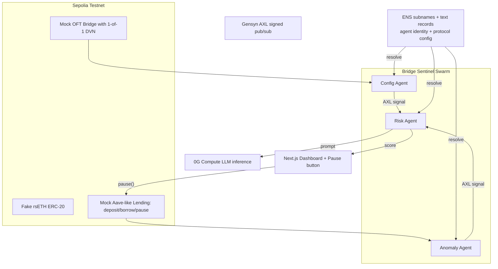

# Bridge Sentinel — Hackathon Implementation Plan

## Goal & Definition of Done

The project is **complete** when a judge can:

1. Open a public live-demo URL (Vercel) and a 3-minute video.
2. Click a single **Run Demo** button (or run a single CLI command) that triggers the KelpDAO replay on a public testnet.
3. Watch the dashboard, in real time, show:

- Config Agent flagging the bridge as `1-of-1 DVN` (high risk) within seconds of the contract being deployed.
- Anomaly Agent detecting the unusual deposit + max-borrow pattern within seconds of the on-chain events.
- Risk Agent (running on **0G Compute**) producing a 9+/10 score with an LLM-generated explanation.
- The pause transaction landing on-chain (via a Pause button in the dashboard) before the attacker can fully exit.

1. Verify all three sponsor tracks are integrated functionally (no hardcoded ENS, real AXL signals, real 0G Compute inference).

If all the steps below hit their completion criteria, the project is done.

---

## Sponsors (3 tracks)

- **Gensyn AXL** — peer-to-peer signed comms between the 3 agents (no central broker).
- **0G Compute** — Risk Agent's LLM inference runs on 0G Compute (qwen3.6-plus or equivalent), giving the security verdict a verifiable inference trail.
- **ENS** — agent identity, per-protocol monitoring config, and discovery. Targets the "Best ENS Integration for AI Agents" prize. Must be functional (no hardcoded values).

The `pause()` flow is just a button in the dashboard that directly calls the contract via the connected wallet. the Anomaly Agent only watches on-chain events.

---

## Architecture

---

## Repo Layout (proposed)

Flat layout, one independent project per folder. No workspaces, no turbo, no shared package — just plain `package.json` (or `forge`) per folder. Faster to start, easier to reason about, and any subproject can be deployed/copied without untangling.

- `frontend/` — Next.js dashboard (Vercel-deployable).
- `contracts/` — Solidity (Foundry preferred). Mock OFT bridge, fake rsETH, mock lending market.
- `agents/config/` — Config Agent (Node + viem).
- `agents/anomaly/` — Anomaly Agent (Node + viem).
- `agents/risk/` — Risk Agent (Node + 0G Compute SDK).
- `scripts/demo/` — KelpDAO replay script (Node + viem).

Shared TS types between agents are kept dead simple: copy-paste a small `types.ts` into each agent folder when needed. If/when it gets annoying we promote it later — not before.

---

## Team Split

- **Axel:** repo scaffolding, ENS integration, dashboard, pause flow, demo orchestration script, video.
- **BearPrince:** mock contracts, Config Agent, Anomaly Agent, Risk Agent + 0G Compute, AXL pub/sub layer.

---

## Step-by-Step Plan

### Step 1 — Initial folder setup (Axel, ~1h)

What:

- Create the top-level folders, each as its own independent project. Keep it dumb and fast.
  - `frontend/` — `pnpm create next-app frontend --ts --tailwind --eslint --app`, then `pnpm dlx shadcn@latest init` and drop in `button` + `card`.
  - `contracts/` — `forge init contracts` (Foundry). Add OpenZeppelin via `forge install OpenZeppelin/openzeppelin-contracts`.
  - `agents/config/`, `agents/anomaly/`, `agents/risk/` — each is `pnpm init` + add `tsx`, `viem`, `dotenv`, with a minimal `src/index.ts` that logs `"hello from <agent name>"` and a `pnpm dev` script.
  - `scripts/demo/` — same minimal `pnpm init` + `tsx` + `viem`.
- Top-level `.env.example` listing every env var any subproject will need (Sepolia RPC, deployer key, ENS name, AXL endpoint/keys, 0G Compute key). Each subproject reads only what it needs from its own `.env`.
- Top-level `README.md` with a one-paragraph project description and a "how to run each folder" section.
- Top-level `.gitignore` covering `node_modules`, `.env`, `out/`, `cache/`, `.next/`.
- Initialize git, push to GitHub.

Done when:

- `cd frontend && pnpm dev` opens the default Next.js page.
- `cd contracts && forge build` succeeds.
- `cd agents/config && pnpm dev` (and same for `anomaly`, `risk`, `scripts/demo`) prints the hello-world line.
- Repo is on GitHub, both teammates have it cloned and running.

### Step 2 — Mock contracts on Sepolia (BearPrince, ~4h)

What:

- `MockOFTBridge.sol` with a configurable DVN setup (`setDVN(uint8 required, address[] dvns)`) and a `mint(address to, uint256 amount)` function that simulates a bridge message landing.
- `FakeRsETH.sol` (ERC-20) minted only by the bridge.
- `MockLending.sol` with `deposit`, `borrow`, `pause`, `unpause`, owner-pausable, emits clean events with indexed user/asset.
- Deploy script that writes addresses + ABIs to `contracts/deployments/sepolia.json`.

Done when:

- All three contracts are deployed on Sepolia, addresses committed in JSON.
- A manual command from inside `contracts/` (e.g. `forge script script/Simulate.s.sol --broadcast`) can: set 1-of-1 DVN → mint 116k rsETH to attacker EOA → deposit into lending → borrow max WETH. All txs land successfully.

### Step 3 — Config Agent (BearPrince, ~3h)

What:

- Node service that polls the bridge contract every 15s with viem.
- Reads DVN config and applies a scoring rule: `1-of-1 = 2/10`, `1-of-2 = 4/10`, `2-of-3 = 7/10`, `3-of-5 = 9/10`.
- Emits a `ConfigSignal { protocol, contract, score, summary, evidence, timestamp }` over AXL (stub local in-memory bus until Step 6).

Done when:

- Running the agent against the deployed bridge logs the correct score.
- Calling `setDVN(2, ...)` on the contract → next poll the agent emits an updated signal with a new score within 30s.

### Step 4 — Anomaly Agent (BearPrince, ~4h)

What:

- viem `watchContractEvent` against `MockLending` for `Deposit` and `Borrow`.
- Stateful detector: same wallet deposits >X% of an asset's supply AND borrows >Y% LTV within Z minutes → emit anomaly.
- For the demo we tune thresholds so the KelpDAO replay reliably trips the detector.
- Emits `AnomalySignal { wallet, asset, depositAmount, borrowAmount, ltv, severity, txHashes, timestamp }`.

Done when:

- Running the simulate script triggers the agent to emit a signal within 5 seconds of the borrow tx confirming.
- Signal contains correct tx hashes and amounts (visible in agent logs).

### Step 5 — Risk Agent on 0G Compute (BearPrince, ~5h)

What:

- Subscribes to both signal types.
- Builds a structured prompt: "You are a DeFi security agent. Given this config signal and this anomaly signal, output JSON `{score: 0-10, explanation, recommended_action}`."
- Calls **0G Compute** SDK (e.g. `qwen3.6-plus` or `GLM-5-FP8`).
- Stores last N decisions in memory and exposes them over AXL + an HTTP endpoint for the dashboard.

Done when:

- Feeding mock signals via a test harness produces a valid JSON `RiskScore` in <10s.
- The 0G Compute call is real (no Claude/OpenAI fallback in the final demo path).
- The KelpDAO scenario consistently produces score >= 9.

### Step 6 — Gensyn AXL integration (BearPrince, ~4h)

What:

- Each agent process runs as its own AXL node with its own keypair.
- Config + Anomaly publish to a single channel; Risk subscribes.
- Each message is signed; receivers verify against the publisher's ENS-registered pubkey (Step 7).
- Replace the in-memory bus from Steps 3-5 with real AXL.

Done when:

- All 3 agents run as 3 separate processes, connected only via AXL.
- Killing the Anomaly Agent process → Config Agent and Risk Agent keep working; bringing it back → it rejoins automatically.
- Tampering with a signal payload (manual test) makes the Risk Agent reject it.

### Step 7 — ENS integration (Axel, ~5h)

What:

- Register `bridgesentinel.eth` (or a free `*.test` equivalent on Sepolia ENS).
- Subnames as agent identities: `config.bridgesentinel.eth`, `anomaly.bridgesentinel.eth`, `risk.bridgesentinel.eth`.
- Text records on each agent subname: `agent.role`, `agent.version`, `agent.axl_pubkey`, `agent.endpoint`.
- Per-protocol subname: `kelpdao.bridgesentinel.eth` with text records: `monitored.bridge`, `monitored.lending`, `pause.threshold`, `alert.channel`.
- All agents at startup resolve their config from ENS — **zero hardcoded contract addresses or thresholds in code** (this is required by ENS's qualification rules).
- Dashboard shows the protocol's ENS card live (resolve `kelpdao.bridgesentinel.eth` and render its text records).

Done when:

- Updating `pause.threshold` in the ENS text record changes the threshold the next time the Risk Agent runs (verified by re-running the demo).
- Updating `monitored.bridge` to a different contract address makes the Config Agent watch a different contract on next restart.
- Each agent verifies the others' AXL message signatures against the pubkey it resolves from ENS, not from a config file.

### Step 8 — Dashboard (Axel, ~10h, can start in parallel from Step 1)

What:

- Next.js + Tailwind + shadcn.
- Pages/sections:
  - Top bar: protocol name (from ENS), current overall risk score, pause button.
  - Agents row: 3 cards showing online/offline (AXL heartbeat), latest signal, ENS subname.
  - Signals timeline: live feed of Config and Anomaly signals (websocket or polling against the agents' HTTP endpoints).
  - Risk Agent panel: latest score, LLM explanation, model attestation info from 0G Compute.
  - Protocol config card: live read of `kelpdao.bridgesentinel.eth` text records.
  - **Pause button**: when risk >= threshold, becomes prominent. Clicking it calls `pause()` on the lending contract through the connected wallet (wagmi + RainbowKit). Optional auto-pause toggle.
- Demo bar at the top with a single "Run KelpDAO Replay" button that triggers the demo script (Step 9) and follows the timeline visually.

Done when:

- Deployed on Vercel, pointing at the live agents.
- Connecting a wallet on Sepolia and clicking Pause lands a real `pause()` tx.
- During a demo run, every step in Step 9 is visible on the dashboard within seconds.

### Step 9 — Demo replay script (Axel + BearPrince, ~3h)

What:

- One Node script in `scripts/demo/` (run via `cd scripts/demo && pnpm dev`, also wired to the dashboard button) that:
  1. Resets/redeploys the lending contract or pauses-then-unpauses it.
  2. Sets the bridge to 1-of-1 DVN.
  3. Mints 116,500 fake rsETH to a fresh attacker EOA.
  4. Deposits into lending, borrows max WETH.
  5. Waits and prints the timeline as agents react.

Done when:

- Running the script end-to-end takes <2 minutes from "Run" to "pause() landed".
- The dashboard tells the same story visually.
- Re-runnable any number of times without manual cleanup.

### Step 10 — Submission polish (Axel + BearPrince, ~5h)

What:

- Top-level README with setup, architecture diagram, and "how to run each folder" instructions (no per-package README clutter).
- 3-minute demo video walking through the KelpDAO story → live replay → pause.
- ETHGlobal submission for each track:
  - **AXL** track: highlight peer-to-peer signed signals between independent agents.
  - **0G** track (Track 2: Autonomous Agents/Swarms): swarm coordination + 0G Compute for verdicts; explain we considered iNFT/Storage and scoped them out for MVP.
  - **ENS** track: identity, metadata, discovery, gating, all functional and resolved at runtime.
- Architecture diagram (mermaid above, exported as PNG).
- Live demo URL + GitHub repo public.

Done when:

- All 3 submissions are filed on ETHGlobal with the qualification requirements ticked.
- Video uploaded and linked.
- Live demo URL works from a fresh browser (verified by the teammate who didn't deploy it).

---

## Risk & Shortcut Notes

- If 0G Compute SDK is flaky on the day, fall back to a thin wrapper that hits 0G Compute first and Claude as a logged backup, but the demo path **must** show 0G Compute working at least once on stage.
- If AXL setup blocks for >half a day, ship it as "AXL channel between Risk Agent and the others" and keep the Config↔Anomaly link as a simpler signed HTTP webhook — still meets the "peer-to-peer signed signals" narrative.
- ENS L1 registration is slow and costs gas; use Sepolia ENS or an L2 ENS gateway from day 1, not mainnet.
- Don't build retry/private-routing for the pause tx — a wallet execution on Sepolia is enough for the MVP.
- Skip iNFTs and 0G Storage for the MVP. Mention them in the README as "next steps" — judges like to see a clear roadmap.

---

## Suggested Day-by-Day

- **Day 1:** Step 1 (Axel, ~1h) → Axel rolls into Step 8 scaffolding. Step 2 (BearPrince).
- **Day 2:** Step 3 + Step 4 (BearPrince) + Step 7 starts (Axel) + Step 8 keeps growing (Axel).
- **Day 3:** Step 5 + Step 6 (BearPrince) + Step 7 finished + Step 8 wiring real data (Axel).
- **Day 4:** Step 9 + Step 8 polish + cross-integration testing.
- **Day 5:** Step 10 (video, submissions, final live deploy).
