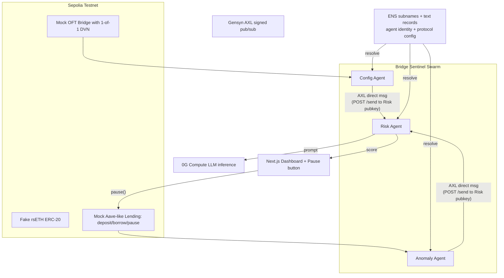

# Bridge Sentinel — Hackathon Implementation Plan

## Goal & Definition of Done

The project is **complete** when a judge can:

1. Open a public live-demo URL (Vercel) and a 3-minute video.
2. Click a single **Run Demo** button (or run a single CLI command) that triggers the KelpDAO replay on a public testnet.
3. Watch the dashboard, in real time, show:

- Config Agent flagging the bridge as `1-of-1 DVN` (high risk) within seconds of the contract being deployed.
- Anomaly Agent detecting the unusual deposit + max-borrow pattern within seconds of the on-chain events.
- Risk Agent (running on **0G Compute**) producing a 9+/10 score with an LLM-generated explanation.
- The pause transaction landing on-chain (via a Pause button in the dashboard) before the attacker can fully exit.

1. Verify all three sponsor tracks are integrated functionally (no hardcoded ENS, real AXL signals, real 0G Compute inference).

If all the steps below hit their completion criteria, the project is done.

---

## Sponsors (3 tracks)

- **Gensyn AXL** — peer-to-peer direct messaging between the 3 agents via AXL Go nodes. Each agent runs an AXL sidecar binary exposing a local HTTP API (`localhost:9002`). Messages are sent point-to-point using ed25519 public keys (no channels/topics — AXL is direct P2P, not pub/sub). Sender identity is verified via the `X-From-Peer-Id` header matched against ENS-stored pubkeys.
- **0G Compute** — Risk Agent's LLM inference runs on 0G Compute. Testnet model: `qwen-2.5-7b-instruct` (mainnet has qwen3.6-plus, GLM-5-FP8, etc. but requires real 0G tokens). SDK: `@0glabs/0g-serving-broker` with an ethers.js wallet on the 0G chain. Responses include TEE attestation via `ZG-Res-Key` header, verifiable with `broker.inference.processResponse()`.
- **ENS** — agent identity, per-protocol monitoring config, and discovery. Targets the "Best ENS Integration for AI Agents" prize. Must be functional (no hardcoded values). Uses viem `getEnsText()` for reads, `@ensdomains/ensjs` for writes/subname creation. Deployed on Sepolia ENS (free registration).

The `pause()` flow is just a button in the dashboard that directly calls the contract via the connected wallet. The Anomaly Agent only watches on-chain events.

### Sponsor SDK/Dependency Summary

| Sponsor | Package / Binary | Auth | Network |
|---------|-----------------|------|---------|
| Gensyn AXL | Go binary (`git clone gensyn-ai/axl && go build`) | ed25519 keypair (`openssl genpkey -algorithm ed25519`) | P2P over Yggdrasil, local HTTP on `:9002` |
| 0G Compute | `@0glabs/0g-serving-broker` + `ethers` | Wallet with 0G tokens (min 3 0G ledger + 1 0G/provider) | 0G testnet RPC: `https://evmrpc-testnet.0g.ai` |
| ENS | `viem` (reads) + `@ensdomains/ensjs` (writes) | Wallet on Sepolia | Sepolia testnet |

---

## Architecture

---

## Repo Layout (proposed)

Flat layout, one independent project per folder. No workspaces, no turbo, no shared package — just plain `package.json` (or `forge`) per folder. Faster to start, easier to reason about, and any subproject can be deployed/copied without untangling.

- `frontend/` — Next.js dashboard (Vercel-deployable).
- `contracts/` — Solidity (Foundry preferred). Mock OFT bridge, fake rsETH, mock lending market.
- `agents/config/` — Config Agent (Node + viem).
- `agents/anomaly/` — Anomaly Agent (Node + viem).
- `agents/risk/` — Risk Agent (Node + `@0glabs/0g-serving-broker` + `ethers`).
- `agents/transport/` — Shared transport abstraction: `LocalTransport` (HTTP stub) and `AxlTransport` (AXL sidecar wrapper). Tiny module, copy into each agent or import from here.
- `scripts/demo/` — KelpDAO replay script (Node + viem).
- `scripts/setup-ens/` — ENS setup script: register subnames, set text records (Node + `@ensdomains/ensjs`).
- `axl/` — AXL node configs and keypairs (`.pem` files in `.gitignore`). Built binary lives here too.

Shared TS types between agents are kept dead simple: copy-paste a small `types.ts` into each agent folder when needed. If/when it gets annoying we promote it later — not before.

---

## Team Split

- **Axel:** repo scaffolding, ENS integration, dashboard, pause flow, demo orchestration script, video.
- **BearPrince:** mock contracts, Config Agent, Anomaly Agent, Risk Agent + 0G Compute, AXL pub/sub layer.

---

## Step-by-Step Plan

### Step 1 — Initial folder setup (Axel, ~1h)

What:

- Create the top-level folders, each as its own independent project. Keep it dumb and fast.
  - `frontend/` — `pnpm create next-app frontend --ts --tailwind --eslint --app`, then `pnpm dlx shadcn@latest init` and drop in `button` + `card`.
  - `contracts/` — `forge init contracts` (Foundry). Add OpenZeppelin via `forge install OpenZeppelin/openzeppelin-contracts`.
  - `agents/config/`, `agents/anomaly/`, `agents/risk/` — each is `pnpm init` + add `tsx`, `viem`, `dotenv`, with a minimal `src/index.ts` that logs `"hello from <agent name>"` and a `pnpm dev` script.
  - `scripts/demo/` — same minimal `pnpm init` + `tsx` + `viem`.
- Top-level `.env.example` listing every env var any subproject will need (Sepolia RPC, deployer key, ENS name, AXL endpoint/keys, 0G Compute key). Each subproject reads only what it needs from its own `.env`.
- Top-level `README.md` with a one-paragraph project description and a "how to run each folder" section.
- Top-level `.gitignore` covering `node_modules`, `.env`, `out/`, `cache/`, `.next/`.
- Initialize git, push to GitHub.

Done when:

- `cd frontend && pnpm dev` opens the default Next.js page.
- `cd contracts && forge build` succeeds.
- `cd agents/config && pnpm dev` (and same for `anomaly`, `risk`, `scripts/demo`) prints the hello-world line.
- Repo is on GitHub, both teammates have it cloned and running.

### Step 2 — Mock contracts on 0G testnet (BearPrince) ✅

Deployed to **0G testnet (chain 16602)** instead of Sepolia — same wallet has 0G tokens for Step 5.

Contracts (4 total, all verified on `chainscan-testnet.0g.ai`):
- `FakeRsETH.sol` — ERC-20, open mint. `0x2b54FeC881C9230A2740Bef0E1d91E50Eb483ca1`
- `MockWETH.sol` — ERC-20, open mint (borrow asset). `0x7740B82991d0c659A370EF82a4910E0e914C4253`
- `MockOFTBridge.sol` — configurable DVN + mint. `0xD2efb57cFA2a7626d520C45a8304AD3162FE32Af`
- `MockLending.sol` — deposit/borrow/pause, owner+guardian roles, 80% LTV. `0xD46bBD0362b1F8feb764366805F98f8782Ab81DA`

Scripts:
- `Deploy.s.sol` — deploys all 4, seeds 200k WETH liquidity, writes `contracts/deployments/sepolia.json`
- `Simulate.s.sol` — KelpDAO replay: set 1-of-1 DVN → mint 116.5k rsETH → deposit → borrow 93.2k WETH

Tests: 39 passing (5 suites). RPC: `https://evmrpc-testnet.0g.ai`

Note for Steps 3-5: agents should use `https://evmrpc-testnet.0g.ai` as RPC, not Sepolia.

### Step 3 — Config Agent (BearPrince, ~3h)

What:

- Node service that polls the bridge contract every 15s with viem.
- Reads DVN config and applies a scoring rule: `1-of-1 = 2/10`, `1-of-2 = 4/10`, `2-of-3 = 7/10`, `3-of-5 = 9/10`.
- Emits a `ConfigSignal { protocol, contract, score, summary, evidence, timestamp }` via a transport abstraction (stub: local HTTP POST to Risk Agent on localhost; Step 6 replaces with AXL `POST /send` to Risk Agent's pubkey).

Done when:

- Running the agent against the deployed bridge logs the correct score.
- Calling `setDVN(2, ...)` on the contract → next poll the agent emits an updated signal with a new score within 30s.

### Step 4 — Anomaly Agent (BearPrince, ~4h)

What:

- viem `watchContractEvent` against `MockLending` for `Deposit` and `Borrow`.
- Stateful detector: same wallet deposits >X% of an asset's supply AND borrows >Y% LTV within Z minutes → emit anomaly.
- For the demo we tune thresholds so the KelpDAO replay reliably trips the detector.
- Emits `AnomalySignal { wallet, asset, depositAmount, borrowAmount, ltv, severity, txHashes, timestamp }` via the same transport abstraction as Config Agent (local HTTP stub → AXL in Step 6).

Done when:

- Running the simulate script triggers the agent to emit a signal within 5 seconds of the borrow tx confirming.
- Signal contains correct tx hashes and amounts (visible in agent logs).

### Step 5 — Risk Agent on 0G Compute (BearPrince, ~5h)

What:

- Receives signals from Config and Anomaly agents (via local HTTP stub, replaced by AXL in Step 6).
- Builds a structured prompt: "You are a DeFi security agent. Given this config signal and this anomaly signal, output JSON `{score: 0-10, explanation, recommended_action}`."
- Calls **0G Compute** via `@0glabs/0g-serving-broker` SDK with an ethers.js wallet on the 0G testnet chain (`https://evmrpc-testnet.0g.ai`). Model: `qwen-2.5-7b-instruct` (testnet). The broker handles auth headers and payment.
- Verifies response integrity via `broker.inference.processResponse(providerAddress, chatID)` — TEE attestation.
- Stores last N decisions in memory and exposes them over an HTTP endpoint for the dashboard.

Setup prerequisite: Fund the 0G wallet with testnet 0G tokens (min 3 0G for ledger creation, 1 0G per provider sub-account). Use `broker.ledger.depositFund()` and `broker.ledger.transferFund()`.

Done when:

- Feeding mock signals via a test harness produces a valid JSON `RiskScore` in <10s.
- The 0G Compute call is real (no Claude/OpenAI fallback in the final demo path).
- The `ZG-Res-Key` header is captured and verification passes.
- The KelpDAO scenario consistently produces score >= 9.

### Step 6 — Gensyn AXL integration (BearPrince, ~4h)

What:

- Build the AXL Go binary: `git clone https://github.com/gensyn-ai/axl.git && cd axl && go build -o node ./cmd/node/` (requires Go 1.25.x; use `GOTOOLCHAIN=go1.25.5` if on Go 1.26+).
- Generate 3 ed25519 keypairs (`openssl genpkey -algorithm ed25519 -out private-<agent>.pem`), one per agent.
- Each agent process runs alongside its own AXL node sidecar (separate Go process). Config on ports: Config=9002, Anomaly=9012, Risk=9022 (configurable via `api_port` / `tcp_port` in `node-config.json`).
- Config + Anomaly send messages directly to Risk Agent's pubkey via `POST http://localhost:<port>/send` with `X-Destination-Peer-Id: <risk_pubkey>`. Risk Agent polls `GET /recv` for incoming signals.
- Receiver verifies sender identity: the `X-From-Peer-Id` response header must match the pubkey stored in ENS for that agent (Step 7). No application-level signing needed — AXL's transport-layer ed25519 identity provides authenticity.
- Replace the local HTTP stub transport from Steps 3-5 with AXL send/recv calls.

Peer config: each node's `node-config.json` lists the other nodes in `"Peers": ["tls://<ip>:<tcp_port>"]`. For local dev, all nodes peer with each other on localhost.

Done when:

- All 3 agents run as 3 separate processes + 3 AXL node sidecars, connected only via AXL.
- Killing the Anomaly Agent process → Config Agent and Risk Agent keep working; bringing it back → it rejoins automatically.
- Risk Agent rejects messages where `X-From-Peer-Id` doesn't match a known agent pubkey from ENS.

### Step 7 — ENS integration (Axel, ~5h)

What:

- Register `bridgesentinel.eth` on Sepolia ENS (free — just testnet gas). Use https://app.ens.domains on Sepolia or register programmatically via ETHRegistrarController (commit-reveal pattern).
- Create subnames via `@ensdomains/ensjs` `createSubname()`: `config.bridgesentinel.eth`, `anomaly.bridgesentinel.eth`, `risk.bridgesentinel.eth`.
- Set text records on each agent subname via `setRecords()` (batched multicall): `agent.role`, `agent.version`, `agent.axl_pubkey` (64-char hex ed25519 pubkey from AXL), `agent.endpoint`.
- Per-protocol subname: `kelpdao.bridgesentinel.eth` with text records: `monitored.bridge`, `monitored.lending`, `pause.threshold`, `alert.channel`.
- All agents at startup resolve their config from ENS via viem's `getEnsText()` — **zero hardcoded contract addresses or thresholds in code** (this is required by ENS's qualification rules).
- Dashboard shows the protocol's ENS card live (resolve `kelpdao.bridgesentinel.eth` and render its text records).
- Setup script (`scripts/setup-ens.ts`) creates all subnames and sets all text records in one run.

SDK dependencies: `viem` (reads — already installed), `@ensdomains/ensjs` (writes — add to setup script).

Done when:

- Updating `pause.threshold` in the ENS text record changes the threshold the next time the Risk Agent runs (verified by re-running the demo).
- Updating `monitored.bridge` to a different contract address makes the Config Agent watch a different contract on next restart.
- Each agent verifies incoming AXL messages: `X-From-Peer-Id` must match the `agent.axl_pubkey` text record resolved from the sender's ENS subname.

### Step 8 — Dashboard (Axel, ~10h, can start in parallel from Step 1)

What:

- Next.js + Tailwind + shadcn.
- Pages/sections:
  - Top bar: protocol name (from ENS), current overall risk score, pause button.
  - Agents row: 3 cards showing online/offline (AXL heartbeat), latest signal, ENS subname.
  - Signals timeline: live feed of Config and Anomaly signals (websocket or polling against the agents' HTTP endpoints).
  - Risk Agent panel: latest score, LLM explanation, model attestation info from 0G Compute.
  - Protocol config card: live read of `kelpdao.bridgesentinel.eth` text records.
  - **Pause button**: when risk >= threshold, becomes prominent. Clicking it calls `pause()` on the lending contract through the connected wallet (wagmi + RainbowKit). Optional auto-pause toggle.
- Demo bar at the top with a single "Run KelpDAO Replay" button that triggers the demo script (Step 9) and follows the timeline visually.

Done when:

- Deployed on Vercel, pointing at the live agents.
- Connecting a wallet on Sepolia and clicking Pause lands a real `pause()` tx.
- During a demo run, every step in Step 9 is visible on the dashboard within seconds.

### Step 9 — Demo replay script (Axel + BearPrince, ~3h)

What:

- One Node script in `scripts/demo/` (run via `cd scripts/demo && pnpm dev`, also wired to the dashboard button) that:
  1. Resets/redeploys the lending contract or pauses-then-unpauses it.
  2. Sets the bridge to 1-of-1 DVN.
  3. Mints 116,500 fake rsETH to a fresh attacker EOA.
  4. Deposits into lending, borrows max WETH.
  5. Waits and prints the timeline as agents react.

Done when:

- Running the script end-to-end takes <2 minutes from "Run" to "pause() landed".
- The dashboard tells the same story visually.
- Re-runnable any number of times without manual cleanup.

### Step 10 — Submission polish (Axel + BearPrince, ~5h)

What:

- Top-level README with setup, architecture diagram, and "how to run each folder" instructions (no per-package README clutter).
- 3-minute demo video walking through the KelpDAO story → live replay → pause.
- ETHGlobal submission for each track:
  - **AXL** track: highlight peer-to-peer signed signals between independent agents.
  - **0G** track (Track 2: Autonomous Agents/Swarms): swarm coordination + 0G Compute for verdicts; explain we considered iNFT/Storage and scoped them out for MVP.
  - **ENS** track: identity, metadata, discovery, gating, all functional and resolved at runtime.
- Architecture diagram (mermaid above, exported as PNG).
- Live demo URL + GitHub repo public.

Done when:

- All 3 submissions are filed on ETHGlobal with the qualification requirements ticked.
- Video uploaded and linked.
- Live demo URL works from a fresh browser (verified by the teammate who didn't deploy it).

---

## Risk & Shortcut Notes

- If 0G Compute SDK is flaky on the day, fall back to a thin wrapper that hits 0G Compute first and Claude as a logged backup, but the demo path **must** show 0G Compute working at least once on stage. Note: testnet only has `qwen-2.5-7b-instruct` — if prompt quality is poor, consider mainnet `qwen3.6-plus` (requires real 0G tokens).
- 0G wallet funding: need testnet 0G tokens. Check 0G faucet availability early. If faucet is down, this blocks Step 5 entirely.
- AXL requires Go 1.25.x to build the node binary. If Go build fails or AXL nodes can't peer (e.g., firewall/NAT issues in the hackathon venue), fall back to direct HTTP POSTs between agents on localhost — same message format, just skip the AXL sidecar. This still demonstrates the architecture; mention AXL as "integrated in local dev, production-ready for multi-host deployment."
- If AXL setup blocks for >half a day, keep Config→Risk and Anomaly→Risk as direct HTTP POSTs with a shared HMAC secret for auth — still meets the "peer-to-peer signed signals" narrative.
- ENS: Sepolia ENS registration is free (testnet gas only). No L1/mainnet needed.
- Don't build retry/private-routing for the pause tx — a wallet execution on Sepolia is enough for the MVP.
- Skip iNFTs and 0G Storage for the MVP. Mention them in the README as "next steps" — judges like to see a clear roadmap.

---

## Suggested Day-by-Day

- **Day 1:** Step 1 (Axel, ~1h) → Axel rolls into Step 8 scaffolding. Step 2 (BearPrince).
- **Day 2:** Step 3 + Step 4 (BearPrince) + Step 7 starts (Axel) + Step 8 keeps growing (Axel).
- **Day 3:** Step 5 + Step 6 (BearPrince) + Step 7 finished + Step 8 wiring real data (Axel).
- **Day 4:** Step 9 + Step 8 polish + cross-integration testing.
- **Day 5:** Step 10 (video, submissions, final live deploy).
